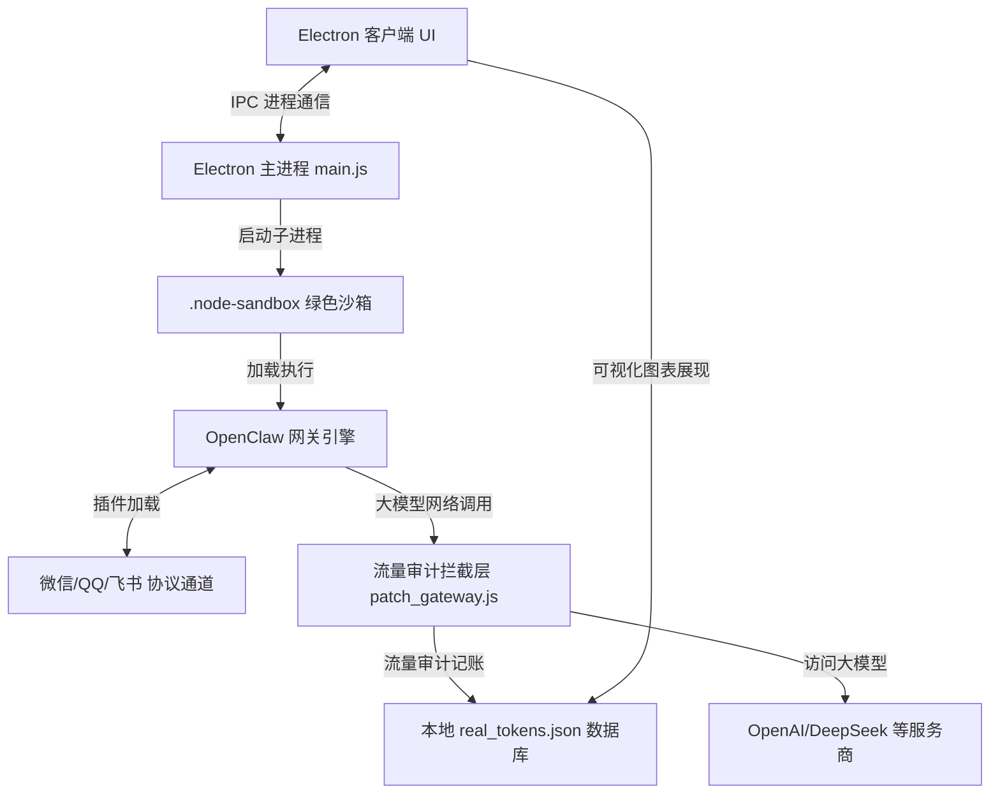

# ClawAI 开源版 🤖

<p align="center">
  
</p>

<p align="center">
  <strong>基于 Electron + OpenClaw 深度定制的本地免配置 AI 智能网关控制台</strong>
</p>

<p align="center">
  <a href="https://nodejs.org"></a>
  <a href="https://github.com/electron/electron"></a>
  <a href="LICENSE"></a>
</p>

---

## 📖 项目简介

**ClawAI** 是一款专为降低 AI 智能网关（Agent Gateway）部署门槛而打造的**傻瓜式桌面控制台客户端**。

不管你是刚接触 AI 的电脑小白，还是专业的开发者，ClawAI 都能让你在**不配置任何全局编程环境**的前提下，一键拉起本地 AI 消息路由总线。通过扫码，你就能让自己的微信、QQ、飞书等社交账号瞬间化身拥有“长期记忆”、“联网搜索”、“任务看板”等超级能力的智能 AI 助手！

---

## ✨ 核心特色功能一览（小白看得懂，大佬用得爽）

| 功能模块 | 功能介绍 | 小白白话解释 |
| :--- | :--- | :--- |
| **🚀 一键启停网关** | 极简图形界面，后台 Node.js 沙箱进程一键开启/关闭，自带终端级流式日志。 | 点一下按钮，AI 助手的“大脑”就开始在后台运转了，不需要敲代码！ |
| **💬 多渠道一键绑定** | 支持 **微信、QQ、飞书、Slack、WhatsApp、Matrix** 等多平台账号一键接入。 | 在电脑上扫个二维码，你的微信号或 QQ 号就直接变成 AI 自动回复机器人了。 |
| **🧠 动态长期记忆** | 内置自动摘要与记忆旋转算法，将关键对话信息持久化写入本地 **`MEMORY.md`** 文件。 | 即使对话聊了几天几夜，AI 也不会忘掉你的名字、爱好或重要约定。你还能直接用记事本修改记忆！ |
| **📊 Token 流量卫士** | 本地离线记账本，用精美的实时折线图统计 API 消耗、Token 成本、响应耗时。 | 像水表一样清清楚楚展示你调模型花了几分钱、响应快不快，数据完全保存在你本地。 |
| **🧩 插件可视化管理** | 卡片式呈现所有内置插件（Bonjour 局域网发现、DuckDuckGo 联网搜索等），一键开关。 | 想让 AI 具备“联网搜索”功能？找到对应卡片，点一下开关，它就能去百度/谷歌查资料了。 |
| **🔒 密钥物理安全锁** | 配置框内的 API 密钥（Key）强制只读、禁止右键、强力拦截键盘复制与鼠标拖拽。 | 别人用你的电脑时，绝对没办法复制、拷贝或偷走你花钱买的大模型 API Key。 |
| **⚡ 绿色环境自愈** | 独立隔离的 `.node-sandbox` 运行环境，开机自检，缺啥补啥，无需手动配置 PATH。 | 你的电脑里不需要装 Node.js 或各种配置，重装系统或换电脑拷贝即用，永不报环境错误。 |

---

## 🎯 傻瓜式新手使用教程

跟着以下 5 个步骤，即使你是第一次用，也能在 3 分钟内搭建起自己的 AI 聊天机器人。

### 第一步：安装程序（一路下一步）
1. **下载安装包**：前往本项目的 **[Releases 页面](https://github.com/2014-y/ClawAI/releases)** 下载最新版 `ClawAI Setup 2.0.0.exe` 安装包。
2. **双击运行**：如果遇到 Windows 蓝屏提示“SmartScreen 拦截”（未签名软件保护），请点击 **“更多信息”** -> **“仍要运行”**。
3. **完成安装**：你可以自定义安装到 D 盘或其他目录，安装程序仅需十秒即可释放全部核心环境。

### 第二步：一键开启本地 AI 服务（看灯等就绪）
1. **打开软件**：双击桌面的 **ClawAI** 快捷方式启动应用。
2. **点下启动**：点击左上角或控制面板右侧的 **「启动 ClawAI」** 按钮。
3. **观察状态指示灯（非常重要）**：
   * 🔴 **红色（未启用）**：服务处于关闭状态。
   * 🟡 **黄色闪烁（启动中）**：系统正在自动校验配置文件，拉起后台通信端口。
   * 🟢 **绿色（正常）**：当后台日志输出 `ClawAI运行时全部核心业务插件装载完毕` 时，指示灯瞬间转绿，代表服务已彻底暖机完毕，随时待命！

### 第三步：扫码绑定微信号 / QQ号
1. **选择渠道**：在控制台右侧的独立渠道卡片上，点击切换按钮（如选择 **QQ**、**微信** 或 **飞书**）。
2. **生成二维码**：点击下方的小药丸，系统会自动在中间的控制台日志区画出黑白的 **二维码图形**。
3. **手机扫码**：拿出手机，打开对应的 APP（如微信或 QQ），扫描屏幕上的二维码，并在手机上同意登录。
4. **绑定成功**：绑定后，卡片上的状态指示灯会由红色的 **“未配置/未绑定”** 瞬间变为绿色的 **“已绑定”**。

### 第四步：调教你的 AI “长期记忆”
1. AI 在和你聊天时，会自动在你的电脑上建立一个记忆账本：`C:\Users\你的用户名\.openclaw\workspace\MEMORY.md`。
2. **手动修改记忆**：如果你想让 AI 记住特殊的人或规则，你可以直接用“记事本”或任何文本编辑器打开这个 **`MEMORY.md`** 文件，往里面写类似“* Yuan 喜欢喝美式咖啡”的话，保存即可。AI 在下一次对话中会自动读取并记住！

---

## 🛠️ 技术架构与系统流向

ClawAI 使用**主从双进程架构**与**物理沙箱隔离设计**，最大程度保障客户端的安全与稳定性：



### 1. 主进程与自愈设计 (main.js)
负责维持子进程生命周期。如果检测到后台网关异常死锁，主进程会强制执行杀进程和环境自愈，确保软件永远不会卡死。

### 2. 流量拦截与消耗统计 (patch_gateway.js)
采用无侵入式代理方法，劫持 Node.js 的底层 `http` 与 `https` 请求。每次 AI 和模型对话时，拦截器都会抓取返回的 Token 数量，并折算成真实的 API 消费金额存入本地 `real_tokens.json` 数据库，绝不向任何第三方泄露您的 API Key 及用量。

---

## ❓ 常见问题与自助排查（避坑指南）

#### Q1. 提示端口 `18789` 被占用，或者状态灯一直是红的？
* **原因**：之前运行的后台网关可能没有退出彻底，或者别的程序抢占了该端口。
* **解决办法**：完全退出软件。在电脑任务管理器中，找到所有的 `node.exe` 进程并强行结束，然后重新打开 ClawAI 即可。

#### Q2. 扫码绑定微信或 QQ 时，控制台一直没有刷出二维码？
* **原因**：大模型 API 连接超时，或者本机的网络环境无法顺畅拉起登录认证协议包。
* **解决办法**：确保电脑网络通畅，检查 API 密钥是否输入正确。在连接海外模型或依赖拉取时，推荐开启本机的网络加速环境。

#### Q3. 在“云电脑”或“虚拟机”下使用，控制台疯狂报错？
* **原因**：在虚拟网卡环境（如网易千玺、阿里云无影云桌面等）中，内置的 `Bonjour 发现` 插件会因为多播协议冲突引起高频报错。
* **解决办法**：点击左侧的 **「内置插件」**，找到 **「Bonjour 发现」** 卡片，将其开关置为 **关闭（Disable）**。然后在主页点击“停止”并重新“启动”网关即可。

---

## 💻 开发者指南（源码本地构建）

如果您需要对控制台进行二次开发或本地源码调试，请遵循以下步骤：

### 1. 准备开发环境
拉取代码仓：
```bash
git clone https://github.com/2014-y/ClawAI.git
cd ClawAI
```

### 2. 初始化沙箱
在项目根目录下，双击运行 `init.bat` 脚本（或在 PowerShell 中执行 `.\init.ps1`）。
该脚本会自动拉起独立的 Node.js 绿色沙箱，自动执行合规性版本检查，并拷贝环境。

### 3. 本地运行调试
* **启动桌面应用调试**：
  ```bash
  npm run app:start
  ```
* **独立测试网关子守护进程**：
  运行根目录下的 `start-gateway.bat`。

### 4. 编译打包生成 `.exe` 安装包
运行以下命令，即可在 `dist` 目录下自动生成经过极致优化、安全可靠的 Windows 单文件安装包：
```bash
npm run app:dist
```

---

## 📑 核心文件清单

* `main.js`：Electron 主进程。掌管守护进程生命周期与主窗口通信。
* `renderer.js`：Electron 渲染进程。UI 动效交互、图表统计、以及输入框安全锁控制。
* `openclaw-state.js`：多用户自适应状态目录管理器。动态解析家目录（`OPENCLAW_HOME`）。
* `patch_gateway.js`：核心 API 拦截器。精准捕获网络请求，统计 Token 并记账。
* `locales.js`：中/英/繁 三语本地化多语言翻译映射。
* `config/installer.nsh`：自定义的 NSIS 安装与卸载附加脚本。

---

## 📜 开源协议

本项目遵循 [MIT License](LICENSE) 许可协议。
