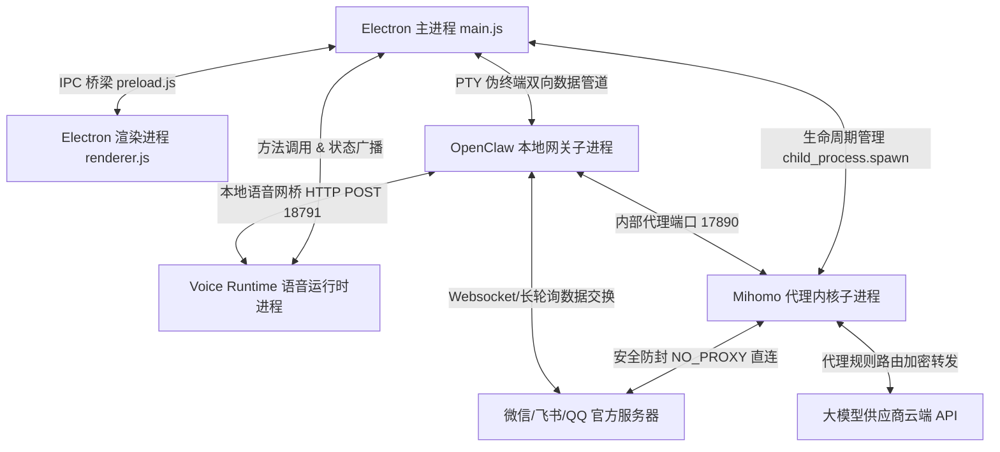

# Nexora Agent

<p align="center">
  
</p>

<p align="center">
  <strong>专为普通用户与独立开发者打造的本地 AI 智能助手桌面版</strong><br/>
  一键安装 · 零代码基础 · 多通讯渠道无缝接入 · 本地安全代理 · 离线语音与物理控制
</p>

<p align="center">
  
  
  
  
  
  
</p>

<p align="center">
  <a href="docs/getting-started.md">新手入门指南</a> ·
  <a href="docs/install-guide.md">安装说明手册</a> ·
  <a href="docs/wechat-guide.md">微信渠道接入</a> ·
  <a href="docs/technical-spec.md">技术架构 Specification</a>
</p>

---

## 🌟 它是做什么的？

**Nexora Agent** 是一个部署在您本地 Windows 操作系统上的 **智能化多渠道 AI 助手控制台**。

许多开发者都梦想拥有一个专属的 AI 助理，能帮您在**微信、QQ、飞书**等平台上自动托管回复客户咨询，做社群气氛活跃组，甚至能记住您和好友的日常偏好与设定，越用越聪明。传统的开源 AI 机器人方案通常需要您去租用云服务器、配置 Node.js/Python 深度学习环境、编写通道适配逻辑、并手工处理复杂的 API 代理设置，这极易因为版本不匹配或环境报错被挡在门外。

**Nexora Agent 实现了完全的图形化开箱即用，无需任何代码基础与复杂的系统配置！**
您只需：
1. **双击安装** 本客户端程序。
2. 点击主界面上的 **「启动 Nexora Agent」** 按钮。
3. 填入大模型厂商的 API Key（支持 DeepSeek、阿里云百炼、智谱 AI、OpenAI 等标准兼容端点）。
4. 掏出手机扫码授权。
一切就已就绪，您的本地 AI 助手便会即刻在对应的通讯软件中替您自动托管日常对话！

---

## 📋 详尽系统功能与底层技术解密 (Whitepaper)

为了帮助广大普通用户和开发者深度理解 Nexora Agent 的运行原理，我们在此列出详尽的功能设计清单，并对每个模块在底层**物理硬件层**、**操作系统层**和**网络协议层**的运行原理进行深度解密：

### 1. 多进程拓扑与系统消息路由架构
Nexora Agent 在运行时并非单一的单线程进程，而是采用了解耦的多进程拓扑架构设计。为了保障桌面界面的流畅（UI 高帧率）以及避免重型 IO/网络处理导致客户端假死，主进程将各个服务拆分为独立的子进程进行生命周期维护和状态同步：



- **Electron 主进程 ([main.js](file:///c:/Users/Yuan/Desktop/ClawAI/NexoraAgent/main.js))**：作为系统的最高管理者，拥有操作系统的完整访问权限。它负责管理应用生命周期、冷启动本地 Node 沙箱、调起 OpenClaw 子进程、运行本地语音运行时及管理 Mihomo 代理内核进程；同时负责捕获未处理的异常并输出到 `main_error.log` 中。
- **Electron 渲染进程 ([renderer.js](file:///c:/Users/Yuan/Desktop/ClawAI/NexoraAgent/renderer.js))**：在完全隔离的 Chromium 容器沙箱中运行，无法直接访问系统资源，必须通过 [preload.js](file:///c:/Users/Yuan/Desktop/ClawAI/NexoraAgent/preload.js) 暴露的 IPC 安全通道与主进程进行通信，负责前端交互逻辑的呈现、设置模型 API 配置以及终端日志显示。

---

### 2. 💬 多平台即时通讯托管系统 (Channel Connectors)
本系统提供了统一的即时通讯通道适配层，允许将大模型的能力无缝分流至多个即时通讯软件，提供全自动的对话接管服务。

#### 微信渠道托管 (WeChat Integration)
*   **极简扫码绑定设计**：通道插件在启动后自动向远端微信服务器发起鉴权握手，并在内存中构建登录 UUID 凭证。网关捕获该凭证，将其转换为 Base64 二维码二进制流，通过 IPC 投递到 Electron 前端绘制。用户仅需使用个人微信扫码确认，通道即在数秒内建立。
*   **会话持久化与静默热重连**：扫码成功后，微信通道在本地隔离沙箱内序列化保存 Session 安全令牌（包含授权 Token、客户端标识与加密 Cookie 集合）。当遇到局域网瞬断或客户端重启时，系统将尝试利用本地凭证进行静默“热重连（Hot Reconnect）”，在 1 秒内自适应恢复在线状态，规避了频繁扫码的繁琐。
*   **陌生人安全配对与前置防火墙**：为防止非授权好友或大量微信群聊无限制刷爆用户的 AI 模型 Token 额度，网关内置了安全拦截层。未授权的微信号发信时，网关会拦截请求，并反向自动回复：“您好，我是主人的 AI 助手。为了防止额度滥用，请向主人申请加白，配对码为：`[XXXX]`”。主人可在客户端「通讯管理」中一键审核同意，将其加入白名单，保障账户额度安全。

#### 飞书渠道托管 (Feishu Integration)
*   **企业自建应用 API 挂载**：主要面向办公流程、智能排班与流程自动化的托管。支持对接飞书开放平台企业自建应用，通过 WebSocket 事件长连接监听来自单聊和群聊的 `@` 发言。
*   **异步富文本卡片交互**：本模块深度解析飞书的富文本格式，并支持大模型异步向飞书群内推送精美的交互卡片（Action Cards），支持在卡片上直接点击执行特定回调，适合对接本地自动化工具链。

#### QQ 渠道托管 (QQBot Integration)
*   支持官方 QQ 机器人 API 接入（配置 AppID、令牌等安全信息），同时兼容主流的扫码热绑定，满足日常 QQ 群运营和粉丝互动托管。

---

### 3. 🧠 智能网关路由与长期记忆中枢 (LLM & Memory)

#### 统一大模型路由中枢 (OpenClaw Hub)
大模型供应商的接口字段千差万别，如果直接在每个渠道里编写适配代码，会导致代码极度臃肿且难以维护。OpenClaw 路由层将国内外各大主流 API 服务商（DeepSeek、GPT、通义千问、智谱清言、火山引擎等）的非标准请求接口，在本地全部封装转换为标准的 **OpenAI Chat Completions** 格式。用户只需在界面「模型配置」中填入 Key，即可一键在各渠道中切换当前使用的大脑模型，实现快速的分发路由。

#### 本地 Markdown 增量长期记忆库 (MEMORY.md)
传统的 AI 助手每次对话都是“断忆”的。如果每次请求都带上漫长的前序历史，不仅会导致 API 消费额度呈指数级上涨，还会因为上下文太长而产生“注意力分散（Attention Decay）”。
Nexora Agent 自研了长期记忆沉淀机制。当每次对话结束时，网关会在后台启动异步抽取线程，识别该次对话中用户的偏好、特定设定或重大事实，以独占锁定写锁的方式，将新事实增量合并至本地 `%USERPROFILE%\.openclaw\MEMORY.md` 文件中。

为了避免条目堆积造成“记忆污染”，记忆引擎会解析 Markdown 的列表结构，并在语义层面进行相似度对比去重：
*   **增量构建与去重**：每次合并都会提取 Markdown 的标题与列表项，在语义层面进行对比去重，防止重复条目污染记忆。在下一次对话启动时，网关会检索该记忆库并将高相关性的记忆切片注入大模型的 System Prompt 顶部，实现跨越会话周期的“长期人格与记忆”。

#### MCP (Model Context Protocol) 插件整合
网关集成了 Model Context Protocol，支持挂载外部的本地 MCP 插件服务（例如本地文件读写器、网页爬虫、Google 搜索服务）。这允许大模型根据需要主动发起工具调用（Tool Call），读取本地文件或查询最新网页信息，突破了其固有的训练知识边界，让本地助手具备物理文件感知与实时检索能力。

---

### 4. 🗣️ 全离线神经网络语音运行时 (Voice Runtime)
为了在无网环境或对隐私保护有极高要求的场景下提供语音交互，系统内置了强大的全离线语音运行时（[voice-runtime.js](file:///c:/Users/Yuan/Desktop/ClawAI/NexoraAgent/voice-runtime.js)）：

#### 离线 ASR 与 VAD 静音判定滑窗算法
启动后，系统调用本机物理声卡捕获 16000Hz 原始 PCM 字节流。
利用内置的 VAD（语音活动检测）模型进行滑窗概率计算，以 $10ms$ 帧长实时计算输入信号的“有人声概率”。

在 VAD 判定逻辑中，系统维护一个音频概率滑动窗口。设当前分析的音频帧为 $f_t$，经过 VAD 模型推理得出的有人声概率为 $P(f_t)$。系统通过以下机制检测用户的说话状态：
- **开启录音**：当连续 $N_{\text{start}}$ 帧满足 $P(f_t) > \theta_{\text{start}}$（阈值一般设为 `0.55`）时，判定用户开始说话，触发 ASR 录制：
  $$ \sum_{i=t-N_{\text{start}}}^{t} \mathbb{I}\left(P(f_i) > \theta_{\text{start}}\right) = N_{\text{start}} $$
- **静音截断**：当系统处于录音状态，且检测到连续 $N_{\text{end}}$ 帧（对应持续约 `800` 毫秒）的概率满足 $P(f_t) < \theta_{\text{end}}$（阈值一般为 `0.35`）时，判定用户说话结束，立即截断录音缓存：
  $$ \sum_{i=t-N_{\text{end}}}^{t} \mathbb{I}\left(P(f_i) < \theta_{\text{end}}\right) = N_{\text{end}} $$

音频被截断后，直接送入本地的 Sherpa-Onnx 声学编码器翻译为文本。整个过程**没有任何一字节的语音数据上传至云端**，彻底保护谈话隐私。

#### 离线中英混合 TTS 语音合成与 Windows SAPI 降级兜底
*   **VITS 神经网络离线合成**：本模块直接加载本地的 VITS 神经网络语音生成模型（预设为中英混合男声音色包 `fanchen-wnj-zh-en`）。TTS 引擎将 LLM 输出的 Markdown 文本通过字音转换器转换为拼音与音素，利用 CPU 进行多线程 ONNX 推理生成 PCM 格式的物理音频流并输出给声卡播放。
*   **SAPI (Speech API) 降级兜底**：为了兼容低端电脑和未下载庞大语音包的用户，系统会自动降级调用 Windows 系统原生的 `SAPI` COM 组件。它通过加载内存 COM 组件，以零网络依赖、零硬件开销的方式实现稳定朗读。

#### 本地 18791 语音网桥服务 (Voice Bridge HTTP Port)
为了解决多通道网关进程与主进程之间的跨进程语音调用，主进程在本地监听 `18791` 端口，提供局域网语音桥接服务。
- 当在微信、QQ 或飞书渠道启用了 `voice-bridge` 插件后，子进程每当收到 AI 的回复文本，就会将该文本通过 HTTP POST 发送到 `http://127.0.0.1:18791/voice/speak`。
- 语音运行时在接收到请求后，会先对文本进行 Markdown 净化（剥离 `#`、`*`、超链接和代码块等），然后按照标点符号和最大字数限制将长文本切割为短片段，依次推入单队列播放缓冲区（FIFO 播放队列）中。
- 语音运行时提供了物理级的静音接口，一旦用户点击主界面上的「静音」，系统会立刻清空队列并中断当前的音频物理输出进程。

---

### 5. 🚀 Mihomo 内核网络代理加速与防风控路由 (Network Acceleration)

大模型 API 访问经常受阻，但全局代理又容易导致微信等通讯应用频繁异地登录而被风控封号。为此我们设计了“双路网络分离”方案：

#### 内核托管
系统在 `%LOCALAPPDATA%\NexoraAgent\acceleration` 中托管了原生的 mihomo 代理内核。支持订阅链接解析、配置文件导入、节点延迟测速和节点自由切换，并在本地 17890 端口开启代理。

#### 进程级环境变量隐式注入
传统的全局代理软件会强行改变操作系统的全局路由，导致其他无关软件（如网络游戏和网页）变慢或产生连接冲突，且极难配置。
客户端启动网关子进程时，自动在子进程的环境变量（`process.env`）中注入 `HTTP_PROXY` 和 `HTTPS_PROXY` 指向本地端口。Node.js 的 HTTP 客户端会自动读取并走该代理加速，完全不需要更改用户的 Windows 系统全局代理，避免对其他网络游戏和软件产生网络冲突。

#### 安全防封直连域名过滤
*   **风控封号痛点**：微信、飞书等渠道的连接若经过海外代理，会被腾讯和字节服务器瞬间触发风控（异地登录封号）。
*   **解决机制**：系统在注入环境变量时，会同时向子进程注入一份长达数十个主机的 `NO_PROXY` 绕过列表（包含所有微信域名、QQ 域名、飞书域名和钉钉域名）。
    通讯插件向微信/飞书服务器发起的 Session 握手和消息心跳包，在网络底层会自动识别并强行绕过代理，通过本地物理网卡真实 IP 直连。只有向大模型 API 发起请求时，才走代理加速。这在技术层面上彻底规避了因“异地 IP 跳变登录”触发的即时通讯账号风控，从源头上防范了封号隐患。

---

### 6. 🖥️ 物理级桌面控制与自动化 (Computer Use)
本系统集成了物理级的计算机使用框架，使本地 of AI 助手不仅仅停留在文字聊天，而是可以如真人一般操控本机的 Windows 系统：

#### 高兼容性屏幕截图 (capture-desktop.ps1)
Windows 环境下，许多第三方截图库在遭遇多显示器或系统缩放 DPI 设置不一致时，会出现图像黑屏或坐标偏移的问题。
系统使用 PowerShell 脚本调用 Windows 底层 .NET 的 `[System.Drawing.Graphics]::CopyFromScreen` 物理截图接口，能够高兼容地捕获多屏边界、防范高 DPI 缩放失真，并将物理画面压缩为 JPEG 字节流喂给视觉模型。

#### 物理设备输入模拟 (desktop-control.ps1)
大模型（如支持 Computer Use 的模型）在分析屏幕截图后，输出目标操作点的屏幕相对坐标 $(x, y)$。
由于传统的应用级模拟容易被 Windows 系统内核防御拦截，网关会通过物理调用本机的 PowerShell 脚本来执行最底层的输入模拟：
- 该脚本在底层通过 C# 声明直接加载 Windows 系统动态链接库 `user32.dll` 里的 `SetCursorPos` 和 `mouse_event` 导出函数。
- 在物理层面，物理像素坐标会通过屏幕分辨率 $W \times H$ 转换映射为 Windows 系统的绝对虚拟坐标：
  $$ X_{\text{win}} = \frac{x \times 65535}{W}, \quad Y_{\text{win}} = \frac{y \times 65535}{H} $$
- 随后，程序向 Win32 API 驱动层投递鼠标位移、物理点击、双击、拖拽和键盘按键序列，穿透第三方软件界面屏障，执行物理级的自动化控制闭环。

---

### 7. 📦 打包部署与磁盘 IO 流水线优化

#### ASAR 差异化解包策略 (asarUnpack)
Electron 默认将所有应用资源归档在 `app.asar` 文件中以保障文件整洁。然而，操作系统内核无法直接在 ASAR 虚拟文件系统中加载 C++ 原生扩展文件（`.node`）或动态链接库（`.dll`）。
为了解决这一技术瓶颈，编译流水线配置了 **“ASAR 解包白名单（asarUnpack）”** 策略，在打包时把 `node-pty`、`sherpa-onnx-node` 等 native 原生组件自动释放在物理目录 `app.asar.unpacked/` 中。Node 运行时在加载原生扩展时，能够自适应路由到物理路径中读取，从而杜绝了加载报错闪退。

#### 异步 IO 解压防界面假死
网关运行时的首次解压释放需要向磁盘写入数万个碎小文件。如果直接在主进程的主线程上执行同步解压，会强行阻塞 Event Loop 导致界面长时间冻结，甚至被 Windows 操作系统判定为“未响应”并强制关闭。
系统通过 `child_process.spawn` 异步拉起后台 `tar` 或 `powershell` 解压进程，主进程只负责异步接收解压进度事件并在界面呈现平滑的进度条，保持 UI 始终保持高帧率流畅。

#### 延迟删除技术 (Deferred RM Tree)
当用户选择重装或者清理本地庞大的运行时目录时，由于文件数目巨大，删除动作极其消耗磁盘 IO 资源。主进程引入了延迟删除技术：主进程通过后台分离方式（`detached: true` 和 `unref()`）启动系统自带的 `cmd.exe /c rmdir /s /q` 并在后台默默执行物理垃圾清理，主进程在发出命令后立刻返回绘制 UI，规避巨量 IO 带来的假死。

---

## 👣 极简使用流程

> 详细配置说明与图文教程请参阅：[新手快速入门指南](docs/getting-started.md)

1.  **第一步：安装与启动**
    *   下载最新发布的桌面安装包并双击运行安装。
    *   打开软件，点击左上角 **「启动 Nexora Agent」** 按钮，等待指示灯由红变黄，最终变为**🟢 绿色（已就绪）**。
2.  **第二步：配置 AI 的大脑**
    *   进入左侧「模型配置」菜单，填入您的 API Key（如 DeepSeek 等平台 Key），然后保存。
    *   在「模型会话」中发送 `你好` 进行快速通路测试。
3.  **第三步：渠道绑定**
    *   进入「通讯管理」菜单，在对应卡片（如微信）点击 **「扫码绑定」**，掏出手机扫码确认授权登录。
    *   当卡片状态变为“已绑定”后，即可拿另外一部手机发送消息测试自动回复！

---

## 🛠️ 故障排除与常见问题 (Troubleshooting & FAQ)

> [!NOTE]
> 本节收录了 Nexora Agent 在日常运行和多进程通信中可能遇到的各类常见故障，并提供了详细的底层原因分析及修复手册。

### 1. ⚠️ 语音网桥报错 `ECONNREFUSED 127.0.0.1:18791` 修复手册
*   **故障现象**：在网关控制台彩色日志或系统运行警报中，频繁弹窗或打印警告：
    `[voice-bridge] speak failed (message_sent): connect ECONNREFUSED 127.0.0.1:18791`
*   **底层原因分析**：
    1.  **语音运行时未开启**：根据 [voice-runtime.js](file:///c:/Users/Yuan/Desktop/ClawAI/NexoraAgent/voice-runtime.js) 的代码逻辑，本地的 18791 端口 HTTP 服务是按需启用的。只有当客户端的**“语音总开关”**和**“渠道回复朗读”**这两个选项同时被勾选为 `true` 时，系统才会通过 `server.listen(18791)` 启动该网桥。如果关闭了语音，后台网关插件在收到 AI 回复后依然尝试向 18791 端口发送 POST 请求，就会连接失败。
    2.  **端口被占用**：其他本地服务（如残留的旧 Nexora 实例进程，或其它第三方调试工具）占用了 `18791` 端口，导致主进程无法成功监听该端口。
    3.  **依赖库加载失败**：Sherpa-Onnx 或 Native C++ 加速 DLL 缺失，导致语音运行时初始化提前崩溃，未能成功建立端口监听。
*   **诊断与解决步骤**：
    1.  **检查配置**：打开 Nexora 客户端界面，进入“语音设置”，确保将**“开启语音功能”**以及**“渠道回复朗读（语音网桥）”**勾选上。
    2.  **强制重置**：如果这两个选项已经开启，尝试将其关闭，等待 2 秒后再重新勾选开启，强制让主进程触发 `_syncHttpServer` 方法进行端口重连监听。
    3.  **排查端口占用**：打开 PowerShell，执行以下命令排查 `18791` 端口是否被占用：
        ```powershell
        Get-NetTCPConnection -LocalPort 18791 -ErrorAction SilentlyContinue
        ```
        若存在占用，可根据返回的 PID 杀掉残留进程：
        ```powershell
        Stop-Process -Id [您的PID] -Force
        ```
    4.  **查看错误日志**：如果依然报错，请检查 `%LOCALAPPDATA%\NexoraAgent\main_error.log` 或软件安装根目录下的 `main_error.log`，排查是否有 `[VoiceRuntime] init failed` 的异常日志信息。

### 2. ⚠️ 本地 Node.js 绿色沙箱环境初始化失败
*   **故障现象**：客户端启动后，网关指示灯一直卡在黄色或红色状态，提示找不到 Node 环境或 `gateway init failed`。
*   **底层原因分析**：内置的绿色沙箱 `node.exe` 运行时，由于用户操作系统缺少 Microsoft Visual C++ Redistributable (2015-2022) 运行库，导致双击运行时报错 DLL 丢失；或是 Windows 系统管理员配置了严格的安全策略，禁止从未签名的临时 AppData 目录调起未知 EXE 应用程序。
*   **解决步骤**：
    1.  **手动安装运行库**：下载并安装 [微软官方 VC++ 运行库合集](https://learn.microsoft.com/zh-CN/cpp/windows/latest-supported-vc-redist?view=msvc-170)。
    2.  **系统降级探活**：确保你的系统全局环境变量中安装了 Node.js（推荐版本 $\ge$ v22）。Nexora Agent 在检测到沙箱不可用时，会自动探测全局环境，若全局环境正常，将自动使用系统自带的 Node.js 调起网关。
    3.  **防拦截加白**：如果安全杀毒软件（如 360 安全卫士、火绒）提示风险拦截，请将 Nexora Agent 整个安装目录和 `%LOCALAPPDATA%\NexoraAgent` 加入到信任白名单中。

### 3. ⚠️ Clash Meta 代理端口 17890 冲突
*   **故障现象**：点击“开启网络加速”后，加速通道的状态灯报错或闪烁，终端打印类似 `listen tcp 127.0.0.1:17890: bind: address already in use` 错误。
*   **底层原因分析**：用户本机的电脑上已经运行了其它 Clash 客户端、V2Ray、或本地爬虫代理服务，占用了 `17890` 的 HTTP 代理默认端口。
*   **解决步骤**：
    1.  **关闭第三方代理**：关闭本地其它占用 17890 端口的科学上网客户端。
    2.  **更改默认端口**：若必须同时运行，可进入 `%USERPROFILE%\.openclaw\openclaw.json`（或点击客户端的“高级设置”），找到 `httpPort` 字段，将其修改为其它未被占用的端口（如 `17898`），保存并重新启动网络加速功能。

---

## 👨‍💻 开发者二次开发与插件开发指南

> [!TIP]
> Nexora Agent 基于高度可扩展的 **OpenClaw 插件容器** 规范构建。开发者可以通过编写简单的 JavaScript 插件来扩展其通讯渠道或为 AI 助手挂载新的 MCP 工具。

### 1. 开发调试环境搭建
如果您是开发者，想要基于本项目进行二次开发或自己尝试打包发布：
```bash
# 1. 克隆代码仓库
git clone https://github.com/2014-y/ClawAI.git
cd Nexora-Agent

# 2. 安装项目依赖 (自动拉取所需的通道与核心包)
npm install

# 3. 运行本地开发环境进行调试
npm run app:start

# 4. 一键编译打包出 Windows 下的绿色免安装目录与 NSIS Setup 安装包
npm run app:dist
```

### 2. 通道插件规范 (OpenClaw Plugin)
一个标准的 OpenClaw 通道插件应该具备以下目录格式：
```
plugins/my-custom-channel/
├── openclaw.plugin.json   # 插件元配置文件
└── index.js               # 插件核心业务逻辑
```

#### 配置文件示例 (`openclaw.plugin.json`)
```json
{
  "name": "my-custom-channel",
  "version": "1.0.0",
  "description": "自定义即时通讯工具连接通道",
  "main": "index.js",
  "settings": {
    "enabled": {
      "type": "boolean",
      "default": false
    },
    "apiToken": {
      "type": "string",
      "default": ""
    }
  }
}
```

#### 业务逻辑实现示例 (`index.js`)
```javascript
'use strict';

class MyCustomChannelPlugin {
  constructor(context) {
    this.ctx = context; // 注入网关上下文，可访问大模型路由、日志模块等
    this.client = null;
  }

  // 插件载入时的生命周期钩子
  async onload() {
    this.ctx.log.info('自定义通道插件已成功载入');
    if (!this.ctx.settings.enabled) return;

    // 建立与您的 IM 服务端的 Websocket 或 HTTP 长轮询连接
    this.client = this._connectToIMServer(this.ctx.settings.apiToken);
    
    // 监听消息事件
    this.client.on('message', async (msg) => {
      // 1. 将收到的消息包装为 OpenClaw 统一的消息对象
      const messagePayload = {
        senderId: msg.fromUser,
        content: msg.text,
        reply: async (replyText) => {
          // 定义如何将 AI 的回复发送回去
          await this.client.send(msg.fromUser, replyText);
        }
      };

      // 2. 投递给智能路由层，大模型会自动处理记忆拼装并触发自动回复
      await this.ctx.router.dispatchMessage(messagePayload);
    });
  }

  // 插件关闭时的销毁钩子
  async onunload() {
    if (this.client) {
      this.client.disconnect();
    }
    this.ctx.log.info('自定义通道插件已成功注销');
  }
}

module.exports = MyCustomChannelPlugin;
```

---

## 📄 许可证协议

本项目采用 [MIT License](LICENSE) 开源许可协议，您可以自由修改、商用或分发。
如需商业用途或有大规模定制需求，请务必保证对本地隐私沙箱及风控隔离安全模块的遵从，共同维护良好的本地 AI 生态。
