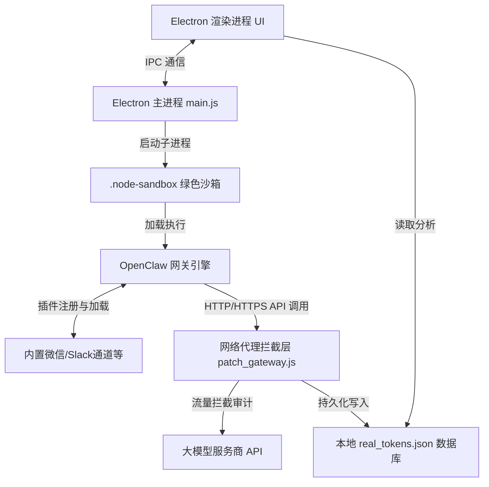

# ClawAI 开源版

<p align="center">
  
</p>

<p align="center">
  <strong>基于 Electron + OpenClaw 深度定制的本地零依赖 AI 智能网关控制台</strong>
</p>

<p align="center">
  <a href="https://nodejs.org"></a>
  <a href="https://github.com/electron/electron"></a>
  <a href="LICENSE"></a>
</p>

---

## 📖 项目简介

ClawAI 是一款专为降低 AI 智能网关（Agent Gateway）部署门槛而设计的桌面控制台客户端。项目基于 **Electron** 桌面框架与 **OpenClaw** 开源 AI 网关底层进行深度重构，通过内置高度优化的绿色运行沙箱及关键插件，实现无需任何全局环境配置、开箱即用的 AI 网关与多渠道聊天（微信、Slack、Matrix 等）接入能力。

---

## 🎯 傻瓜式新手使用教程（每一步都说明白）

无论你是电脑小白还是技术新手，只需跟着以下 5 个步骤，即可在 3 分钟内让你的 AI 助手上线。

### 第一步：获取与安装（小白无脑安装）
1. **下载安装包**：前往本项目的 **[Releases 页面](https://github.com/2014-y/ClawAI/releases)** 下载最新版单文件安装程序 `ClawAI Setup.exe`。
2. **运行安装**：双击下载好的 `.exe` 安装包。如果遇到 Windows 蓝屏警告提示（SmartScreen 拦截），请点击 **“更多信息”** -> **“仍要运行”**。
3. **选择路径**：安装程序默认会选择系统盘，你可以点击“浏览”更改安装到 D 盘或其他磁盘目录，然后一路点击 **“下一步”** 直到安装完成。

### 第二步：一键开启 AI 网关服务
1. **打开软件**：双击桌面的 **ClawAI** 快捷方式启动应用。
2. **启动网关**：进入软件主页后，点击右侧醒目的紫色 **「启动网关」** 按钮。
3. **状态确认**：观察左上角的 **“网关通道状态”**：
   * 启动时：显示红色“未启用”。
   * 启动成功（约 5~10 秒）：状态灯会变绿并显示 **“正常”**，右侧面板状态会切换为“停止网关”。此时说明本地网关服务已完美就绪！

### 第三步：绑定微信（扫码即用）
1. **发起绑定**：网关运行绿灯后，点击控制台右侧的 **「绑定微信」** 按钮。
2. **获取二维码**：后台会自动加载微信登录模块，并在控制台日志区域渲染出黑白的 **二维码图形**。
3. **手机扫码**：拿出手机，打开微信，使用 **“扫一扫”** 扫描屏幕上的二维码，并在手机上确认同意登录。
4. **绑定成功**：扫码完成后，右侧的“微信通道状态”会瞬间由红色的 **“未绑定”** 变成绿色的 **“已绑定”**。

### 第四步：开始与你的 AI 聊天
你可以通过两种方式直接与它互动：
1. **私聊对话**：直接向你刚刚扫码绑定的这个微信账号发送任何消息，AI 会在 1~3 秒内自动回复你。
2. **群聊互动**：将扫码绑定的微信号拉入任何微信群中。在群里 **@ 助手** 并输入问题，助手就会自动在群内做出回复。

### 第五步：功能插件的一键启用与开关
想让 AI 拥有联网搜索、任务管理或双模型训练等高级功能？
1. 点击左侧菜单栏的 **「插件管理」**。
2. 页面中罗列了各种卡片（如：**Bonjour 发现**、**DuckDuckGo 搜索**、**自动摘要**、**任务看板**等）。
3. 无需修改任何代码或配置，直接点击卡片右下角的 **「开关按钮」**，即可瞬间启用或禁用该功能！

---

## 🛠️ 技术架构与系统组成

ClawAI 整体架构采用**主从双进程架构**与**绿色沙箱隔离设计**，核心技术栈及作用如下：



### 1. 桌面客户端外壳 (Electron Shell)
* **主进程 (main.js)**：负责管理窗口生命周期、处理 IPC 通信、监控后台网关子进程运行状态，并提供健壮的安全防护（如防退出冲突、环境自愈）。
* **渲染进程 (renderer.js)**：使用 Vanilla JS 构建，渲染流畅无延迟。内置丰富的交互动效，负责大模型配置管理、卡片动态折叠展开、流量消耗的可视化图表渲染。

### 2. 隔离运行沙箱 (.node-sandbox)
* 预先打包精简版 Node.js 与 npm 绿色环境，用户首次运行或开发初始化时，会自动建立专用的依赖与执行路径。这使得 ClawAI 彻底脱离了对用户系统环境变量（如全局 PATH）的依赖，避免了环境污染，支持多电脑快速无感迁移。

### 3. 网关引擎核心 (OpenClaw Daemon)
* 作为本地后台服务运行。负责维护模型分发服务、会话上下文管理、系统钩子（Hooks）处理以及各种生态插件（Plugins）的动态热加载。

### 4. 流量审计劫持器 (patch_gateway.js)
* 采用无侵入式的方法拦截 Node.js 的 `http` 和 `https` 模块底层的 `request` 方法。当网关引擎向大模型厂商接口发送请求时，拦截器会自动解析输入（Prompt）与输出（Completion）的数据流，精确统计 Token 消耗并估算使用成本，写入本地数据库。

---

## 🌟 核心功能与技术实现细节

### 1. 🔌 零依赖一键运行与环境自愈
* **免装运行环境**：程序启动时会检测 `.node-sandbox` 并自动配置临时环境变量。无需用户预先安装 Node.js、Git、Python 或各种编译工具链。
* **微信插件预装与自适应激活**：在 Electron 主进程读取配置时，会自动对微信插件（`@tencent-weixin/openclaw-weixin`）的本地路径进行动态绝对路径转换，并注入到 OpenClaw 信任列表（`plugins.allow`）。这**彻底解决了在免安装或新电脑运行下，因缺少路径信任导致后台卡死在终端询问（* Install Weixin plugin?）的重大故障，实现秒级生成登录二维码。**

### 🔑 2. 安全级密钥物理隔离与防泄漏锁
为了防范内置密钥泄露，ClawAI 在前端和配置层面实现了多层防盗拷保护：
* **明文禁止查看**：前端界面物理移除了明文查看按钮。
* **输入框只读与防护锁**：内置大模型通道的密钥配置框被强制设为 `readonly`。
* **输入事件强力拦截**：底层重写并拦截了该输入框的键盘复制剪切事件 (`copy`, `cut`)、鼠标拖拽事件 (`dragstart`, `drop`)、以及鼠标右键菜单事件，物理切断了通过界面导出、复制内置密钥的任何可能性。

### 📉 3. 实时 Token Telemetry（流量卫士）
* **底层数据流拦截**：在 `patch_gateway.js` 中，通过改写 Node.js 内置的网络请求，捕获 `openai` 兼容协议包的返回体，分析其 `usage.prompt_tokens` 与 `usage.completion_tokens`。
* **离线本地数据库**：数据以 JSON 结构持久化保存在用户本地目录下的 `real_tokens.json`，确保用量数据的隐私安全。
* **可视化数据折线看板**：在前端“用量监控”中，利用图表库动态绘制折线图，直观展现每日 Token 消耗曲线、API 响应耗时、请求次数以及网关缓存命中率。

### 🎨 4. 页面空间优化与物理防呆锁
* **智能排序与展收**：将主推或内置的大模型卡片置顶渲染，所有卡片默认折叠，通过平滑的折叠动画提供清爽的界面交互。
* **防误删锁**：对关键的核心配置（如默认模型、Ollama 本地模型）卡片进行物理锁定，移除了配置界面上的删除按钮，避免用户误操作导致核心通路断开。

---

## 🔄 运行与运作流程

ClawAI 运行时的数据与控制流向如下：

### 1. 启动与初始化阶段
1. 用户启动 ClawAI 应用。
2. Electron 主进程在后台检测并设置 `.node-sandbox` 绿色运行环境。
3. 主进程读取本地网关配置文件 `.openclaw/openclaw.json`，自动检测微信等关键插件的本地绝对路径并写入路径信任名单。
4. 主进程通过 Node.js 子进程拉起 OpenClaw 网关引擎，并将其 `stdout`/`stderr` 标准输入输出流与主进程绑定。

### 2. 微信/聊天通道绑定阶段
1. 用户在控制台点击「绑定微信」或启用相关插件。
2. 网关引擎启动微信登录子进程（Wechaty 服务）。
3. 微信子进程接收到微信扫码登录 URL，通过标准输出打印。
4. 主进程拦截输出流，过滤 ANSI 颜色逃逸字符，精确提取 URL 并发送给渲染进程。
5. 渲染进程渲染为二维码，用户扫码后微信子进程成功登录。

### 3. 对话与流式转发阶段
1. 用户在微信中向 AI 助手发送消息。
2. 微信通道插件接收消息并封装成 OpenClaw 统一标准格式。
3. 网关引擎处理消息，匹配相应大模型模板，并向大模型服务商发起 API 请求。
4. 网络拦截层 `patch_gateway.js` 拦截该请求，监控其数据交互。
5. 大模型返回回复，网关引擎通过微信通道回复给微信用户。
6. 拦截层记录此次对话所产生的 Token 消耗，写入本地 `real_tokens.json`，前端用量监控同步更新。

---

> [!TIP]
> **💡 魔法网络加速**：如在下载依赖、拉取模型或访问大模型 API 时遇到网络困难，可使用推荐的 [网络加速通道](https://pin.dianping.men/auth/register?code=2k788U5v)（注册即可获取极速网络环境支持）。

---

## ❓ 常见故障自助排查（避坑指南）

### Q1: 点击“启动网关”后，状态灯一直卡在红色，或者提示端口被占用？
* **原因**：这是因为您之前运行的网关进程没有完全退出，或者有其他软件占用了 AI 网关的通信端口 `18789`。
* **解决办法**：请完全关闭软件，在任务管理器里检查并结束名为 `node.exe` 或 `ClawAI` 的进程，然后再重新打开软件运行。如果仍不行，请直接重启电脑，此时占用会自动释放。

### Q2: 点击“绑定微信”后，控制台一直没有刷出登录二维码？
* **原因**：可能因为当前大模型 API 连接超时，或者网络环境无法顺畅拉取必须的安全令牌。
* **解决办法**：确认电脑能够正常连网。如果在大模型请求或初始化上有网络延迟，强烈推荐开启我们在上面 Tip 中提供的 **「魔法网络加速」** 通道以获得稳定极速的网络环境。

### Q3: 开启了某些插件（比如“Bonjour 发现”）后，控制台不断刷屏重复的报错日志？
* **原因**：Bonjour 发现功能主要针对实体物理局域网。如果您是在 **云电脑（如网易千玺、良心云等）、虚拟云主机或虚拟机环境** 下使用本应用，虚拟网卡会产生多播回环，导致 Bonjour 协议冲突从而高频报错。
* **解决办法**：点击左侧 **「插件管理」**，找到 **「Bonjour 发现」** 插件，将开关 **关闭（Disable）**。然后在控制台点击“停止网关”并重新“启动网关”即可。

---

## 🛠️ 开发者指南（源码构建）

### 1. 准备工作
克隆代码库并进入项目根目录：
```bash
git clone https://github.com/2014-y/ClawAI.git
cd ClawAI
```

### 2. 初始化沙箱开发环境
在项目根目录下双击运行 `init.bat` 脚本（或在 PowerShell 中执行 `.\init.ps1`）。它会自动拉起独立 Node 绿色沙箱，复制必要模块并生成基本配置文件。

### 3. 运行与调试
* **启动桌面控制台调试**：
  ```bash
  npm run app:start
  ```
* **手动单独启动网关服务**：
  运行根目录下的 `start-gateway.bat`。

### 4. 编译与打包分发
打包为单文件 Windows 安装包（打包结果输出在 `dist` 目录中）：
```bash
npm run app:dist
```

---

## 📑 项目核心文件说明

* `main.js`：Electron 主进程。负责网关与微信子进程生命周期管理、系统 IPC 数据中转。
* `renderer.js`：Electron 渲染进程。实现大模型通道折叠/展收逻辑、内置通道密钥防复制安全防护、用量看板等前端 UI。
* `patch_gateway.js`：网关 API 拦截插件。通过重写基础网络请求库统计 Token 使用，实现本地离线记账。
* `init.ps1` / `init.bat`：绿色沙箱自动初始化与本地模块热同步。
* `start-gateway.bat` / `start-gateway.ps1`：沙箱环境下独立拉起本地网关守护进程的工具脚本。

---

## 📜 开源协议

本项目遵循 [MIT License](LICENSE) 许可协议。
