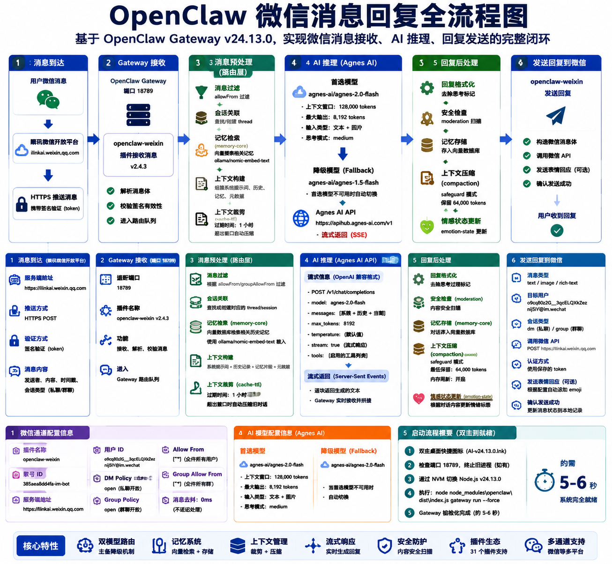

# AI-v24.13.0 开源版

> **Author: [2014-y](https://github.com/2014-y)**

> **本地 AI 助手网关（基于 OpenClaw）— 一键部署，开箱即用**

一个封装了 OpenClaw 网关 + 自定义插件/技能/MCP 的 Windows 桌面 AI 助手项目。  
支持微信/WhatsApp 多渠道消息、Agnes-AI 大模型、图像/视频生成、Computer Use 桌面控制。

## 快速开始

### 前置要求

| 依赖 | 版本 | 说明 |
|------|------|------|
| Windows | 10/11 | 仅支持 Windows |
| NVM for Windows | 最新 | 节点版本管理 |
| Node.js | v24.13.0 | 通过 NVM 安装 |
| npm | 内置于 Node | 包管理 |

### 一键启动

1. 双击 `start-gateway.bat`
2. 网关将在 `http://127.0.0.1:18789` 启动
3. 通过微信/WhatsApp/浏览器连接使用

### 手动安装

```powershell
# 安装 Node.js v24.13.0
nvm install 24.13.0
nvm use 24.13.0

# 安装 OpenClaw
npm install -g openclaw@2026.6.11

# 安装 Computer Use MCP
npm install -g open-computer-use@0.1.54

# 克隆本项目
git clone https://github.com/2014-y/AI-v24.13.0
cd AI-v24.13.0-开源版

# 配置 openclaw.json（复制模板并填入你的 API Key）
copy config\openclaw.json.example config\openclaw.json
# 编辑 config\openclaw.json，填入 agnes-ai API Key

# 启动
.\start-gateway.bat
```

## 架构概览

```
┌─────────────────────────────────────────────────────┐
│                   AI-v24.13.0                       │
├─────────────────────────────────────────────────────┤
│  Gateway (Port 18789)                              │
│  ┌──────────┐  ┌──────────┐  ┌──────────────────┐  │
│  │  Channels│  │  Plugins │  │    Extensions    │  │
│  │          │  │          │  │                  │  │
│  │ WeChat   │  │ Dual     │  │ Channel Router   │  │
│  │ WhatsApp │  │ Model    │  │ Image Generator  │  │
│  │ Google   │  │ Trainer  │  │ Video Generator  │  │
│  └──────────┘  └──────────┘  └──────────────────┘  │
│  ┌──────────────────────────────────────────────┐  │
│  │  Models (Agnes-AI / Ollama)                 │  │
│  │  ┌─────────────┐  ┌──────────────────────┐  │  │
│  │  │ agnes-2.0   │  │ gemma4 (本地)       │  │  │
│  │  │ agnes-1.5   │  └──────────────────────┘  │  │
│  │  └─────────────┘  ┌──────────────────────┐  │  │
│  │                    │ MCP Servers          │  │  │
│  │                    │ - computer-use (9)   │  │  │
│  │                    └──────────────────────┘  │  │
│  └──────────────────────────────────────────────┘  │
│  ┌──────────────────────────────────────────────┐  │
│  │  Media CLI (图片/视频生成)                   │  │
│  │  ┌─────────────┐  ┌──────────────────────┐  │  │
│  │  │ image-gen   │  │ video-gen (30s+)    │  │  │
│  │  └─────────────┘  └──────────────────────┘  │  │
│  └──────────────────────────────────────────────┘  │
│  ┌──────────────────────────────────────────────┐  │
│  │  Skills (20+ 技能包)                         │  │
│  │  video-generator, image-generator,           │  │
│  │  girlfriend-simulator, humanize-cli, ...     │  │
│  └──────────────────────────────────────────────┘  │
└─────────────────────────────────────────────────────┘
```

## 功能特性

### 已包含的功能

| 功能 | 状态 | 说明 |
|------|------|------|
| MCP 多通道通信 | ✅ | 微信/WhatsApp/Google等 |
| Tool Calling | ✅ | 浏览器/数据库/邮件/日历等 |
| Planner | ✅ | 复杂任务拆分多步执行 |
| Workflow | ✅ | 自动执行多步流程 |
| Computer Use | ✅ | 桌面级应用控制（9个工具） |
| 双模型训练 | ✅ | Teacher-Student 蒸馏学习 |
| 记忆核心 | ✅ | 长期记忆搜索 |
| 语音通话 | ✅ | 电话功能 |
| 图像生成 | ✅ | Agnes-AI 图片生成 |
| 视频生成 | ✅ | 30秒+ 视频（动态帧数计算） |
| 健康检查 | ✅ | 系统状态监控 |
| Cron 调度 | ✅ | 定时任务/自动压缩 |

### 技能包列表 (workspace/skills/)

共 20+ 技能，包括：
- `video-generator` — 视频生成
- `image-generator` — 图像生成
- `humanize-cli` — AI 文本人性化
- `girlfriend-simulator` — 女友模拟
- `emotion-state` — 情绪状态
- `multi-character-chat` — 多角色聊天
- `moodcast` — 情绪播报
- `weather-pollen` — 天气花粉
- `ai-humanizer` — AI 内容去 AI 化
- 等...


## 微信消息回复全流程


## 目录结构

```
AI-v24.13.0-开源版/
├── start-gateway.bat          # 一键启动脚本
├── start-gateway.ps1          # PowerShell 启动脚本
├── gateway.cmd / gateway.vbs  # Gateway 辅助启动
├── run-gateway.py             # Python 启动脚本
├── capture-desktop.ps1        # 桌面截图工具
├── desktop-control.ps1        # 桌面控制工具
├── system-info.cmd            # 系统信息查看
├── wmic.cmd / wmic-wrapper.ps1# WMIC 工具
├── auto-finetune.py           # 自动微调脚本
├── jarvis-modelfile.txt       # 模型文件模板
├── openclaw-task.sh           # Linux 启动脚本
├── 查看对话.bat               # 查看会话记录
├── 查看蒸馏.bat               # 查看蒸馏日志
├── 流程图.md                   # 架构图
├── 流程文档.md                 # 详细说明
├── config/                    # 配置目录
│   ├── openclaw.json.example  # 配置模板
│   └── README.txt
├── plugins/                   # 自定义插件
│   ├── dual-model-trainer/    # 双模型训练
│   ├── health-check/          # 健康检查
│   ├── memory-rotate/         # 记忆轮换
│   └── ...
├── extensions/                # 扩展模块
│   ├── channel-router/        # 渠道路由
│   ├── image-generator/       # 图像生成扩展
│   ├── video-generator/       # 视频生成扩展
│   └── ...
├── media-cli/                 # 媒体生成 CLI
│   ├── agnes-media-cli.js     # 主 CLI 脚本
│   └── package.json
├── hooks/                     # 钩子脚本
│   └── auto-start-codex/
├── workspace/
│   └── skills/                # 技能包 (20+)
└── README.md                  # 本文件
```

## 配置说明

### openclaw.json 关键配置

```json
{
  "models": {
    "providers": {
      "agnes-ai": {
        "baseUrl": "https://apihub.agnes-ai.com/v1",
        "apiKey": "YOUR_API_KEY_HERE",
        "models": [
          { "id": "agnes-2.0-flash", "name": "Agnes 2.0 Flash" },
          { "id": "agnes-1.5-flash", "name": "Agnes 1.5 Flash" }
        ]
      }
    }
  },
  "agents": {
    "defaults": {
      "model": {
        "primary": "agnes-ai/agnes-2.0-flash",
        "fallbacks": ["agnes-ai/agnes-1.5-flash", "ollama/gemma4:latest"]
      }
    }
  },
  "plugins": {
    "allow": ["browser", "memory-core", "health-check", "voice-call"]
  },
  "mcp": {
    "servers": {
      "computer-use": {
        "command": "open-computer-use",
        "args": ["mcp"]
      }
    }
  }
}
```

## API 端点

| 端点 | 方法 | 说明 |
|------|------|------|
| `/v1/chat/completions` | POST | 聊天补全 (OpenAI 兼容) |
| `/v1/images/generations` | POST | 图像生成 |
| `/v1/videos` | POST | 视频生成 (CLI) |
| `127.0.0.1:18789` | HTTP | Gateway 主服务 |

## 常见问题

### Q: 启动失败怎么办？
A: 检查以下几点：
1. Node.js v24.13.0 是否已安装 (`node --version`)
2. 端口 18789 是否被占用 (`netstat -ano | findstr 18789`)
3. API Key 是否正确配置在 `openclaw.json` 中
4. 查看详细日志: `gateway-output.log`

### Q: 如何添加新的 MCP Server？
A: 使用命令 `openclaw mcp add <name> --command <cmd> --arg <arg>`

### Q: 视频生成只有 5 秒？
A: 已修复！CLI 现在自动将 duration 转换为 num_frames，支持 30 秒+ 视频。

## 许可证

MIT License

## 技术栈

- **运行时**: Node.js v24.13.0
- **网关框架**: OpenClaw 2026.6.11
- **MCP 服务器**: open-computer-use 0.1.54
- **本地模型**: Ollama (gemma4:latest)
- **云模型**: Agnes-AI (agnes-2.0-flash)
- **数据库**: SQLite (会话存储)


