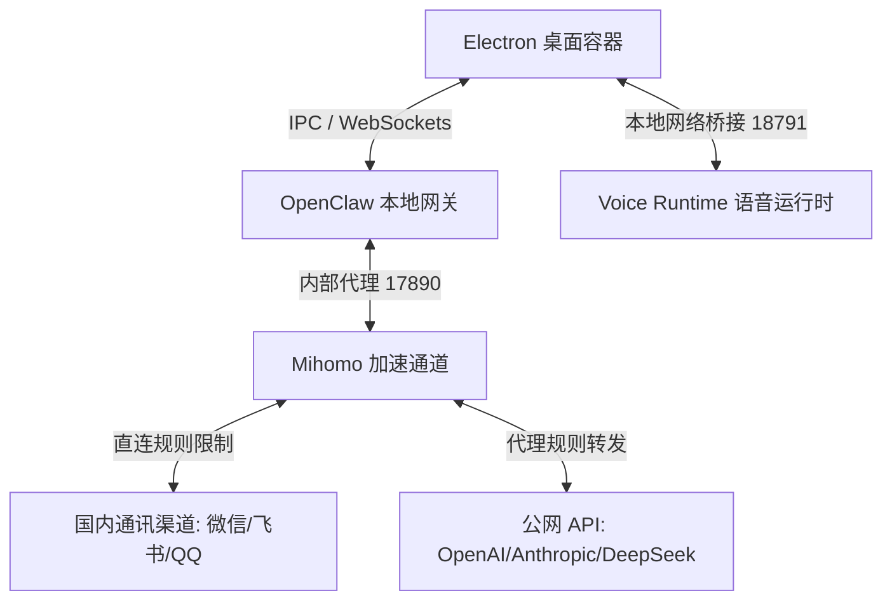
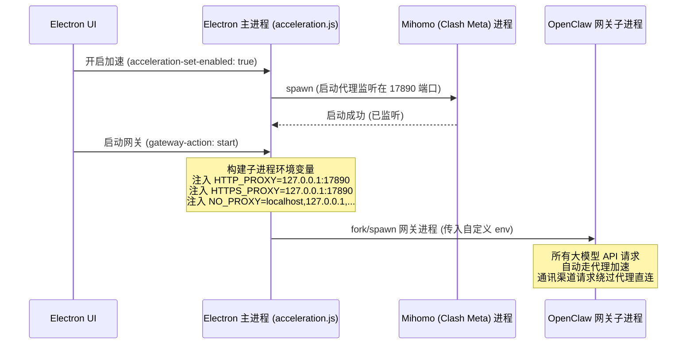

# Nexora Agent 核心技术架构与规格说明书

---

## 前言

**Nexora Agent** 是一款专为小白用户和普通开发者打造的本地 AI 智能助手桌面版应用。它致力于在本地硬件环境中构建起一座连接“大模型智慧”与“日常通讯协作工具（微信、QQ、飞书等）”之间的桥梁。

本文档从底层设计哲学、系统架构蓝图、运行隔离沙箱、智能路由网关、离线语音引擎、网络代理加速、计算机自动化控制等多个维度，对 Nexora Agent 进行了深度技术剖析，旨在清晰讲述其**底层原理、核心功能、数据流转过程、关键技术栈及具体实现方式**。

---

## 1. Nexora Agent 核心设计哲学与架构蓝图

### 1.1 设计背景与核心痛点
传统的 AI Agent 接入通讯渠道（例如将大模型变成微信聊天助手）通常面临以下几个核心痛点：
1. **环境依赖繁琐**：通常需要手动安装 Node.js、Python 等环境，配置复杂的系统环境变量，极易因为版本不匹配而报错。
2. **网络环境障碍**：访问海外大模型（如 OpenAI、Anthropic）需要稳定代理，但全局代理又会导致国内通讯应用（如微信、飞书）频繁异地登录而被风控封号。
3. **数据隐私隐患**：许多一键式接入工具将用户数据上传到中心化服务器，导致大模型 API 密钥、聊天记录等隐私泄漏。
4. **性能损耗与死锁**：Node.js 单线程模型在面对大量文件读写（解包）或高吞吐量的语音流转时，一旦同步阻塞主线程，极易导致客户端卡死、系统判定为“未响应”。

Nexora Agent 围绕 **“开箱即用、隐私本地化、运行隔离、网络避险、体验流畅”** 的核心哲学进行设计，通过桌面客户端的形态提供了一站式解决方案。

### 1.2 整体架构设计（双层三端模型）
Nexora Agent 在物理部署上分为两层，逻辑上呈现为三个独立的子端：



- **第一层：GUI 交互与进程托管层（Electron 桌面容器）**
  基于 Electron 平台，负责提供现代的视觉交互、管理软件生命周期、守护本地服务进程。
- **第二层：本地微服务网关层（OpenClaw 核心 & 辅助运行时）**
  - **OpenClaw 本地网关（调度中枢）**：核心的智能消息路由系统，用于加载配置、载入多平台通讯插件、连接大模型 API、解析插件 MCP 等。
  - **Voice Runtime 语音运行时**：全离线的 ASR（语音识别）与 TTS（语音合成）服务，支持在本地进行语音交互。
  - **Mihomo (Clash Meta) 加速通道**：内置的网络加速服务，以混合端口模式提供局域网代理，同时支持直连过滤。

### 1.3 核心技术栈矩阵
| 层次 / 模块 | 技术选型 | 说明 |
| :--- | :--- | :--- |
| **应用外壳** | Electron | 跨平台桌面客户端容器 |
| **界面表现** | Vanilla HTML5 + CSS3 + ES6 | 轻量，无框架开销，极速加载 |
| **调度中枢** | OpenClaw (Node.js LTS) | 模块化 AI 消息网关与多通道集成框架 |
| **通讯插件** | `@tencent-weixin/openclaw-weixin`, Feishu SDK, QQBot SDK | 通讯通道接入包 |
| **离线语音** | `sherpa-onnx` (Kaldi 新一代), ONNX Runtime, VITS | 本地离线 ASR / TTS 神经网络引擎 |
| **网络加速** | Mihomo (Clash Meta 内核) | 提供高性能的本地代理网关与路由选择 |
| **终端展现** | `node-pty` + `xterm.js` | 实时渲染控制台日志，模拟真实命令行环境 |
| **物理控制** | `open-computer-use` + PowerShell 脚本 | 控制本机的截图、鼠标键盘事件模拟 |

### 1.4 Electron 主进程与渲染进程分工
- **主进程 (Main Process - [main.js](file:///c:/Users/Yuan/Desktop/ClawAI/NexoraAgent/main.js))**：
  拥有操作系统的完全访问权限。负责在系统后台冷启动 Node.js 沙箱环境、拉起 OpenClaw 子进程、冷启动语音运行时与 Mihomo 内核进程；拦截未捕获异常并输出到 `main_error.log`；通过 `ipcMain` 注册大量系统级 API 供渲染进程调用。
- **渲染进程 (Renderer Process - [renderer.js](file:///c:/Users/Yuan/Desktop/ClawAI/NexoraAgent/renderer.js))**：
  在隔离的沙箱环境（启用 contextIsolation）中运行，通过 [preload.js](file:///c:/Users/Yuan/Desktop/ClawAI/NexoraAgent/preload.js) 暴露的 IPC 桥梁访问主进程接口。负责渲染 UI 面板、处理用户操作逻辑、配置模型 Key、展示二维码以及实时渲染 `xterm.js` 传递来的子进程控制台标准输出（stdout）。

---

## 2. 运行环境隔离与本地绿色沙箱技术

### 2.1 独立 Node 运行环境机制 (.node-sandbox)
普通小白用户的电脑通常没有配置 Node.js 开发环境，若让用户自行去配置环境，极易发生各种路径与权限问题。
为此，Nexora Agent 在打包发布包时，在安装目录下内置了一套完整、绿色的 Node.js 压缩沙箱目录 `.node-sandbox`，其中包含了 `node.exe` 及其基础 npm 执行器。

**探活与降级逻辑（主进程 [main.js:119-149](file:///c:/Users/Yuan/Desktop/ClawAI/NexoraAgent/main.js#L119-L149)）**：
1. 主进程首先在本地定位 `.node-sandbox/node.exe`。
2. 使用 `child_process.execFileSync` 同步运行该程序并传入 `-v` 参数进行探活。
3. 若由于操作系统未安装必要的 VC++ 2015-2022 运行库（DLL 缺失）或被 Windows 用户组安全策略限制执行，`execFileSync` 将会抛出异常。
4. 主进程捕捉到异常后，会自动触发降级（Fallback）机制：通过执行命令 `where node` 查找系统全局的环境变量 Node 路径；若全局存在 Node 且版本符合要求（$\ge$ v22），则选用全局 Node 启动网关。
5. 若两者皆不可用，则弹出系统级对话框报错，防止程序在无 Node 状态下静默闪退。

### 2.2 启动加固与运行时解包 (gateway-runtime.js)
在 Electron 编译打包时，若将数万个 node_modules 文件直接封在 `asar` 文件内，由于 native 模块（如 `node-pty` 中的 C++ 扩展、`sherpa-onnx` 的 `.node` 和 C/C++ DLL）无法在 `asar` 压缩归档内被操作系统直接加载，会导致 native 崩溃。

**分层解压策略**：
- 静态资源、主渲染进程脚本保留在 `app.asar` 中以确保启动速度。
- 底层网关运行时（OpenClaw 及其全部核心依赖包）在打包前，通过脚本 `pack-gateway-runtime.js` 离线预打包为 `.tar` 文件（`gateway-runtime.tar`），存放在 Electron 的 `extraResources` 中。
- 客户端在首次启动时，异步读取该 `tar` 包，解压到用户目录 `%LOCALAPPDATA%\NexoraAgent\gateway-runtime` 中。
- 解压过程使用子进程异步调用系统 `tar` 命令（[gateway-runtime.js:155-172](file:///c:/Users/Yuan/Desktop/ClawAI/NexoraAgent/gateway-runtime.js#L155-L172)）。若执行失败，会启动一个拥有 `Bypass` 执行策略的 PowerShell 子进程：
  ```powershell
  powershell -NoProfile -ExecutionPolicy Bypass -Command "tar -xf 'tarPath' -C 'destDir'"
  ```
  以此确保在受限环境下仍能正常解包。

### 2.3 伪终端与控制台日志投递 (node-pty + xterm.js)
为了给技术人员或需要排错的用户提供可视化的终端输出，Nexora Agent 并没有把子进程的日志简单重定向到只读的文本框中，而是集成了 `node-pty` 和 `xterm.js`。

**技术实现方式**：
- 在主进程中，使用 `node-pty` 在 Windows 操作系统上拉起一个真正的 Pseudoterminal (PTY) 子进程，绑定系统的 Shell（如 cmd.exe 或 powershell.exe），并在该终端内执行 `node start-gateway.js`。
- `node-pty` 捕获终端返回的原始 ANSI 控制字符（包含高亮颜色、进度条渲染、换行回车等）。
- 主进程通过 IPC 事件 `builtin-terminal-data`，实时将这些原始 ANSI 字节流投递到渲染进程。
- 渲染进程使用 `xterm.js` 结合 `xterm-addon-fit` 插件，将字节流实时渲染在前端页面上，呈现出完美的彩色控制台效果。
- 渲染进程的按键事件同样通过 `builtin-terminal-write` 反向传给主进程的 `node-pty`，从而使用户可以直接在 Electron 界面上对后台的子进程终端进行控制交互。

---

## 3. 智能网关路由与多平台通讯引擎 (OpenClaw & Channel Connectors)

### 3.1 调度中枢 (OpenClaw) 工作原理
OpenClaw 是 Nexora Agent 的核心调度网关。它的核心配置文件是位于 `%USERPROFILE%\.openclaw\openclaw.json`（备份文件在根目录下）。
网关启动后，会在本地监听特定的控制端口（默认 `18789`）。

其工作流如下：
1. **启动插件容器**：根据 `openclaw.json` 加载启用的通讯通道插件（如 `@tencent-weixin/openclaw-weixin`、`@openclaw/feishu`）。
2. **初始化鉴权体系**：生成并读取本地控制 Token，为主渲染进程的控制台提供基于 HTTP / WebSocket 鉴权的长链接。
3. **注入代理环境**：如果检测到加速通道已开启，网关在启动插件和模型路由前，会将环境变量 `HTTP_PROXY` 与 `HTTPS_PROXY` 指向加速通道本地端口，从而让后续的所有 API 访问自动获得加速服务。

### 3.2 长期记忆机制 (MEMORY.md 动态交互)
Nexora Agent 不是一问一答的“断忆”助手，它集成了基于本地的长期记忆栈（Long-term Memory Stack）。

**实现方式**：
- 在用户的配置目录（如 `%USERPROFILE%\.openclaw`）中，程序会维护一个 `MEMORY.md` 文件。
- 该文件以 Markdown 的层级结构持久化存储 AI 在与用户交互过程中沉淀下来的“记忆事实”（包括用户的喜好、过往设定、特定上下文等）。
- 当通讯通道接收到用户发来的消息时，OpenClaw 路由层会在构造向大模型发送的 Prompt 之前，首先异步读取并解析 `MEMORY.md` 里的关键上下文。
- 它利用轻量级的文本提取或者特定的记忆策略，将相关的记忆切片拼接到 System Prompt 或是 User Prompt 顶部。
- 每次对话结束后，AI 助手内部运行的系统级插件会检测是否有新的长期事实产生，若有，则会自动在后台对 `MEMORY.md` 进行增量写入或重构，实现“助手越用越懂你”。

### 3.3 扫码登录代理与会话保持机制
对于微信等网页版/协议版通讯工具，其登录凭证包含极高时效性的 Cookie 和 Session Key，传统的做法是每次启动重新扫码。

**Nexora Agent 的会话保持方案**：
- 用户点击「扫码绑定」时，底层微信通道插件启动，向微信服务器申请登录 UUID，并产生一个登录二维码的二进制流。
- 主进程通过 IPC 将此流以 Base64 格式传递给渲染进程，在前端界面直接以 QR 码图片展示。
- 当用户手机端扫码并确认后，微信通道插件在网关内存中建立与微信长连接（WebSocket / HTTP Long-polling）的会话（Session）。
- 程序会将该会话的部分加密凭证（例如微信的登录 State、本地 Token 等）序列化写入 `%USERPROFILE%\.openclaw` 目录下的状态缓存文件中（如 `openclaw-state.js` 管理的临时持久化数据库）。
- 只要客户端正常退出（未发生崩溃死锁），下一次启动时，微信通道会尝试去读取本地的状态缓存文件，并直接调用微信的“热启动（Hot Reconnect）”接口进行自动连接。如果连接成功，用户便无需再次扫码，真正实现了无缝会话保持。

### 3.4 陌生人配对与白名单安全机制
为防范恶意用户通过私信或者大量微信群聊狂刷用户的 API 额度，Nexora Agent 引入了陌生人授权配对和白名单风控限制。

**工作方式**：
- 当一个未授权的陌生账号（即不在已配对的白名单列表中）第一次给接入了 AI 的微信/飞书发消息时，网关的拦截层会立刻截获此消息，不向上层大模型进行调用投递。
- 拦截层会反向给该用户自动发送一条预设的提示：“您好，我是主人的 AI 助手。为了防止额度滥用，请向主人申请加白。您的专属配对码是：`[XXXX]`”。
- 同时，Nexora Agent 的 Electron 客户端界面会通过 IPC 收到一条配对申请事件，界面右上角会弹出系统通知提示，并在「通讯管理」的面板中增加一条待审核记录。
- 只有当主人在电脑客户端界面上手动点击「同意配对」后，该账号的 ID 才会真正被写入本地白名单配置文件中，之后他发出的每一条消息才能被大模型接收并得到自动回复。

---

## 4. 本地离线语音运行时 (Voice Runtime)

### 4.1 sherpa-onnx 本地语音推理核心
为了在没有网络或者高隐私要求的环境下提供语音聊天和朗读能力，Nexora Agent 内置了基于 `sherpa-onnx` 的离线神经网络语音运行时（[voice-runtime.js](file:///c:/Users/Yuan/Desktop/ClawAI/NexoraAgent/voice-runtime.js)）。

`sherpa-onnx` 相比传统的语音引擎具有极大的优势：
- 它完全不需要在本地启动庞大臃肿的 Python 深度学习框架（如 PyTorch、TensorFlow）。
- 它通过 ONNX Runtime 引擎直接加载经过优化压缩的 `.onnx` 格式语音模型。
- 对 C++ 底层进行了 Node.js 原生 C++ Addon 包装，在 Windows 下利用 `sherpa-onnx-node` 配合多线程直接调用 CPU 指令集进行本地的高性能推理。

### 4.2 中英混合 TTS 语音合成与 Windows SAPI 降级兜底
- **ONNX 高质量合成 (VITS)**：
  Nexora Agent 预设了名为 `fanchen-wnj-zh-en` 的 VITS 模型。这是一个体积约 116MB 的高质量男声音色包，支持中英文双语混合朗读。用户在界面上点击下载该包后，主进程会在 `%LOCALAPPDATA%\NexoraAgent\voice-packs` 目录下自动下载并解压模型。
  当有文字朗读请求到来时，`voice-runtime.js` 调用离线 ONNX 推理器，将文字转换为 PCM 格式的音频数据，并调用底层声卡播放。
- **系统 SAPI 降级兜底**：
  若用户的电脑网络不好，无法下载 100 多兆的离线 ONNX 语音包，或者电脑配置极差，为防卡顿，TTS 模块提供了降级到 Windows 系统原生 SAPI (Speech API) 的能力。它会直接调用 Windows 本地的语音引擎（如微软中文女声 HuiHui 等），通过加载内存 COM 组件，以零网络依赖、零硬件开销的方式实现稳定朗读。

### 4.3 离线语音唤醒字与 ASR 识别流
Nexora Agent 的语音聊天和“纯语音控制”基于全离线的唤醒字和语音识别（ASR）技术。
- **唤醒字检测 (Wake-word Detection)**：
  当开启“唤醒监听”时，系统会在后台以较低音量和超低 CPU 占用率启动监听。主进程调用本地声卡采集当前麦克风的 16kHz 单声道音频流。通过极轻量级的 ONNX 唤醒词检测模型，实时进行滑窗分析。一旦用户说出预设的“你好 Nexora”，模型推理结果触发阈值，立即发出唤醒中断，将系统状态由 `listening_wake` 切换为 `listening`（开始录音）状态。
- **ASR 离线识别**：
  在录音阶段，客户端记录用户的讲话音频。当用户停止说话时，系统会自动进行静音检测（VAD - Voice Activity Detection）。确认说话结束后，将 PCM 原始音频流直接送入本地的离线 ASR 识别模型（基于 Sherpa-Onnx / Whisper-tiny），瞬间将语音翻译为文本，随后将文本投递给大模型调度器。这整个过程没有一字节的音频数据被上传到公网，彻底守护了用户的谈话隐私。

### 4.4 局域网语音桥接服务 (Voice Bridge HTTP Port)
为了让通讯渠道（比如运行在后台网关进程中的微信机器人）在收到消息时，不仅能“打字”回复对方，还能让主人的这台电脑把回复大声读出来，主进程开启了一个局域网语音桥接服务。

- **HTTP 端口**：默认在本地监听 `18791` 端口。
- **工作机制**：网关在处理完微信消息并输出 AI 回复文字后，若在网关中启用了 `voice-bridge` 插件，该插件会向本地的 `http://127.0.0.1:18791/speak` 发送一个包含回复文字 of POST 请求。
- **播放队列**：`voice-runtime.js` 中的 HTTP 路由拦截到请求后，会先对文本进行净化（如去除 Markdown 语法、截断超长字符串），然后将其推入“单队列播放缓冲区（FIFO Queue）”，有序地合成并播放。同时提供静音接口，一旦用户点击主界面上的「静音」，系统会立刻清空队列并中断当前的音频物理输出进程。

---

## 5. Clash Meta 内核驱动的网络代理与防封直连加速 (Network Acceleration)

### 5.1 mihomo (Clash Meta) 本地进程托管
大模型的 API（特别是 OpenAI 等）对国内的直连 IP 访问极其不友好，甚至会直接封禁 API Key。
Nexora Agent 在 `%LOCALAPPDATA%\NexoraAgent\acceleration` 中内置了经过加固和性能优化的 **mihomo (Clash Meta)** 二进制内核文件，提供极简的“网络加速”功能。

**托管流程**：
1. 用户在界面上添加订阅链接或导入 YAML 配置文件。
2. 客户端将其解析并生成本地符合 Clash 标准的运行配置。
3. 当用户在 UI 界面点击“开启网络加速”时，主进程 [acceleration.js](file:///c:/Users/Yuan/Desktop/ClawAI/NexoraAgent/acceleration.js) 会通过 `child_process.spawn` 拉起底层托管的 mihomo 进程。
4. mihomo 进程在本地 `127.0.0.1` 开启 HTTP / SOCKS5 混合代理端口（默认端口为 `17890`）。

### 5.2 代理子网构建与环境变量动态注入
如果让用户自己在系统中去配置系统代理或者去路由软件里改设置，对小白来说是不现实的。
Nexora Agent 采用 **“进程级环境变量注入（Process-level Env Injection）”** 技术来实现智能加速：



在网关子进程启动前，主进程在构建其 `process.env` 时，注入以下环境变量：
- `HTTP_PROXY` = `http://127.0.0.1:17890`
- `HTTPS_PROXY` = `http://127.0.0.1:17890`
- `NO_PROXY` = `localhost,127.0.0.1,::1,0.0.0.0,.weixin.qq.com,.qq.com,.wechat.com,.feishu.cn,.feishu.net,.larksuite.com,.dingtalk.com`

由于 Node.js 的 HTTP 客户端（如 axios、undici 等）在发起请求时，会自动读取当前进程中的 `HTTP_PROXY` / `HTTPS_PROXY` 和 `NO_PROXY` 变量，从而使大模型的 API 访问无需做任何代码修改，就能在网络底层自动完成代理加速。

### 5.3 微信/飞书直连白名单与防封风控保护机制
这是 Nexora Agent 的核心网络安全保障设计。
- **风控痛点**：若微信机器人、飞书机器人或钉钉机器人的 API 请求也频繁经过海外代理节点，腾讯、字节等平台的安全后台会因为“登录 IP 频繁异地变更”、“国外敏感 IP 登录”等指标瞬间触发风控，直接导致用户的个人微信号或企业账号被限制登录、甚至永久封号。
- **解决机制**：通过在环境变量中注入极度严苛的 `NO_PROXY_LIST`。
  主进程配置的绕过代理域名白名单包含了所有的微信域名（如 `.weixin.qq.com`, `.qq.com`, `.wechat.com`）、飞书域名（`.feishu.cn`, `.feishu.net`, `.larksuite.com`）和钉钉域名。
  当通讯插件与平台服务器进行长链接或数据收发时，底层代理网络解析到请求域名在 `NO_PROXY` 列表中，会强行绕过本地的 mihomo 代理端口，直接通过用户本地的真实宽带网络发起直连。
  通过这种“两路分离”的技术手段，既确保了大模型调用不超时，又在技术层面上完美隔绝了异地登录的风控，最大化保护了用户的微信号和资产安全。

---

## 6. AI 物理控制与桌面使用架构 (Computer Use & Automation)

### 6.1 open-computer-use 框架
大语言模型的发展催生了 Agent 能够像人一样操作电脑的需求。Nexora Agent 引进了 `open-computer-use`（对应依赖 `open-computer-use: 0.1.54`），为本地 AI 赋予了物理操作系统的控制权限（Computer Use）。

### 6.2 桌面截图与操作系统指令映射 (PowerShell 自动化)
当网关侧的大模型输出中包含 `Computer Use` 的 Action（例如点击、拖拽、打字、截图等）时，网关会通过物理调用本机的 PowerShell 脚本来执行具体操作。

- **桌面截图 ([capture-desktop.ps1](file:///c:/Users/Yuan/Desktop/ClawAI/NexoraAgent/capture-desktop.ps1))**：
  在 Windows 下，传统的截图库由于权限限制或多屏幕兼容问题极易报错。
  Nexora Agent 选用 PowerShell 脚本，利用 .NET 框架的 `[System.Drawing.Graphics]::CopyFromScreen` 接口。
  该脚本能够高兼容性地捕获用户当前的物理主屏幕画面，压缩成高画质的 JPEG 格式，输出到指定的本地缓存文件中，再由网关将图像转换成 Base64 格式喂给支持多模态的视觉模型（如 Claude 3.5 Sonnet / GPT-4o）。
- **鼠标键盘模拟与控制 ([desktop-control.ps1](file:///c:/Users/Yuan/Desktop/ClawAI/NexoraAgent/desktop-control.ps1))**：
  模型识别屏幕图像后，输出目标操作的相对坐标 $(x, y)$。
  网关解析此坐标，并通过参数形式启动 `desktop-control.ps1` 脚本。
  脚本在底层引入 Windows API 的 `user32.dll` 导出函数（例如 `SetCursorPos` 和 `mouse_event`），在物理层面模拟真实的物理鼠标移动、点击、双击、拖动事件。
  同样，打字与键盘按键通过键盘输入 API 进行模拟。
  这种底层物理模拟技术使得大模型能够完美穿透桌面，操作任何第三方客户端软件。

---

## 7. 核心业务数据流转与 IPC 通信契约

### 7.1 典型业务场景数据流分析（微信消息 -> AI回复）
当外部好友给助手的微信发送了一条消息，整个系统内的数据流转步骤如下：

```
[微信服务器] 
    │ (Websocket/长轮询) 
    ▼ 
[微信通道插件 (@tencent-weixin)] 
    │ (网关内消息拦截)
    ▼
[白名单 & 配对检测] ──(未授权)──> [自动回复配对提示] -> 发回给微信好友
    │ (已授权)
    ▼
[长期记忆库 (MEMORY.md)] ──(读取并拼装上下文)──> [构造 Prompt]
    │
    ▼
[大模型网关路由] 
    │ (注入本地加速 HTTP_PROXY) 
    ▼ 
[Mihomo 代理端口 (17890)] 
    │ (网络代理转发)
    ▼ 
[第三方大模型 API (DeepSeek/GPT)]
    │
    ▼ 返回生成文字 (Markdown)
[长期记忆库] ──(提取新事实，异步增量写入 MEMORY.md)
    │
    ├─(文字流)─> [微信通道插件] ──> [微信服务器] ──> 发回给微信好友 (自动回复成功)
    │
    └─(异步语音桥) ──> [HTTP POST to 18791] ──> [Voice Runtime] ──> 本地喇叭播放
```

### 7.2 语音通话与本地播放流转
1. **音频录制与滑窗**：`voice-runtime.js` 从本机硬件声卡捕获 16000Hz 采样率的原始 PCM 字节流。
2. **VAD 静音截断**：通过 `sherpa-onnx` 的语音活动检测（VAD），滑窗分析 PCM 信号... 确认说话结束。
3. **本地 ASR**：翻译成文字。
4. **大模型推理**：大模型给出文本回复。
5. **本地 TTS**：文本回复投递给本地离线 TTS 引擎，生成音频输出播放。

### 7.3 IPC 通信 API 契约表
主进程与渲染进程之间存在严密的 IPC 通信协议。下表整理了客户端的核心 IPC 通信接口：

| 通信接口名称 (Channel) | 机制 (Pattern) | 传递参数 | 作用说明 |
| :--- | :--- | :--- | :--- |
| `gateway-action` | `send` (单向) | `'start'` 或 `'stop'` | 启动或停止 OpenClaw 后台网关进程 |
| `config-read` | `invoke` (双向) | 无 | 读取本地 `openclaw.json` 配置文件的当前内容 |
| `config-save` | `invoke` (双向) | `newConfig` (配置 JSON) | 写入并保存新的大模型与渠道配置文件 |
| `wechat-login` | `invoke` (双向) | 无 | 初始化微信通道登录流程，返回登录 UUID 与 Base64 二维码 |
| `wechat-check-status` | `invoke` (双向) | 无 | 检测当前微信通道是否处于在线登录绑定状态 |
| `builtin-terminal-start` | `invoke` (双向) | `'zh'` 或 `'en'` | 初始化并拉起 `node-pty` 本地终端子进程 |
| `builtin-terminal-write` | `send` (单向) | `data` (ANSI 字节串) | 向本地终端子进程写入键盘输入命令数据 |
| `voice-get-state` | `invoke` (双向) | 无 | 获取语音运行时当前的配置（音量、语速、启用状态等） |
| `voice-speak` | `invoke` (双向) | `{ text, packId, volume }` | 投递一段文字使其合成语音并在本地播放 |
| `voice-stop` | `invoke` (双向) | 无 | 立刻中断当前的 TTS 播放，并清空播放缓存队列 |
| `acceleration-status` | `invoke` (双向) | 无 | 查询当前代理加速内核的运行状态、内存和订阅列表 |
| `acceleration-set-enabled` | `invoke` (双向) | `(enabled, profileId)` | 开启或关闭 mihomo 加速通道，并指定使用哪个订阅节点 |

---

## 8. 编译打包与部署流水线优化

### 8.1 electron-builder 与 NSIS 自定义安装脚本
Nexora Agent 采用 `electron-builder` 作为打包框架，针对 Windows 系统输出可自动注入的 NSIS 安装包。
由于底层依赖大量的 native 二进制文件，打包时在 `package.json` 中的 `build` 段做了深度定制。
- 配置 `asar: true`，将大部分的前端资源与基础代码逻辑打包进只读的安全 `asar` 容器中。
- 在 `nsis` 段中配置 `oneClick: false` 并指定 `allowToChangeInstallationDirectory: true`，允许用户自定义安装路径。

### 8.2 多进程打包与 ASAR 归档拆解优化
为了解决 native C++ 二进制扩展（`.node`）和 Windows 动态链接库（`.dll`）在 Electron 虚拟 ASAR 文件系统中无法被直接执行的缺陷，编译流水线配置了 **“ASAR 解包白名单（asarUnpack）”** 策略：

```json
"asarUnpack": [
  "**/node_modules/node-pty/**",
  "**/node_modules/@openclaw/**",
  "**/node_modules/@tencent-weixin/**",
  "**/node_modules/sherpa-onnx-node/**",
  "**/node_modules/sherpa-onnx-win-x64/**",
  "**/tts-worker.js",
  "**/*.node",
  "**/*.dll"
]
```

这确保了：
1. 普通的纯 JS 逻辑依然被封在 `app.asar` 中。
2. 只要含有 `.node`、`.dll` 二进制文件，都会被解压释放到 `dist` 目录下的 `app.asar.unpacked/` 物理目录中。
3. 客户端在运行时，Node 加载器能无缝读取到真实的物理文件路径，杜绝加载崩溃。

### 8.3 异步 IO 解压与后台静默清理
由于解压缩运行时压缩包或物理删除包含数万小文件的目录是一项极其耗时的 IO 密集型操作，如果在主线程直接调用同步方法，会导致整个主线程事件循环被挂起数秒。

Nexora Agent 对此进行了深度优化：
1. **异步解压缩**：客户端使用异步子进程 `spawn`，将压缩包解压任务投递给独立的后台进程，主进程只负责接收解压进度日志并显示加载条，UI 始终保持流畅。
2. **后台静默清理 (Deferred RM Tree)**：在升级、重装或者删除缓存目录时，主进程使用后台静默清理技术：在平台为 Windows 时，主进程会使用后台分离方式 (`detached: true` 和 `unref()`) 启动系统自带的 `cmd.exe /c rmdir /s /q [目标目录]`。这会彻底脱离主进程生命周期，由系统默默删除。Electron 客户端可以在发出删除命令后立刻继续绘制 UI，完全避开了磁盘 IO 写入延迟。

---

## 结语

通过将 **Node 绿色沙箱隔离、运行时 ASAR 差异化解包、网络代理的环境变量按需注入、微信/飞书域名直连避险、本地离线 Sherpa-Onnx 语音推理、物理 PowerShell 桌面自动化** 等技术融合，Nexora Agent 成功把一个高门槛的 AI 通道接入项目，重构为了一个对小白用户极其友好、对开发者极其敏捷的现代化桌面控制台软件。
